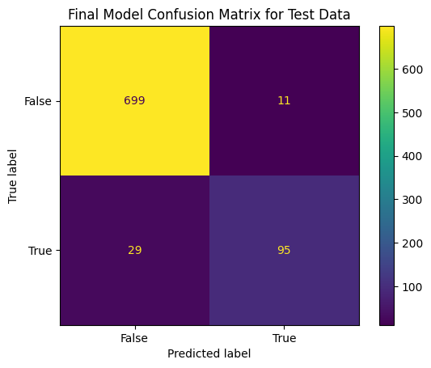
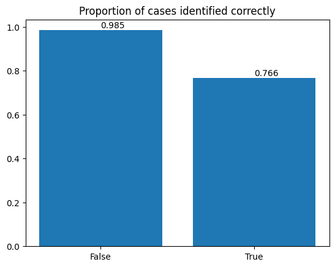

# Predicting customer churn for SyriaTel

## Project Overview
In this project, I am developing a model that predicts whether a given customer would soon stop doing business with the telecom company based on data about the customer.  
To do so, I looked at the available data regarding past customers that the telecom compnay had collected from doing business with them, like the types of mobile plans they had purchased and how frequently they contacted customer service, and tried to find a pattern between such information and whether the customers stopped doing business with the company using classification algorithms.  
I first analysed the data and prepared them for processing, then created a few prediction models iteratively, modifying the next model based on the metircs of the previous one, and lastly used the model with the best metrics as my final model.  

### Business Problem
The goal of this project is to be able to correctly identify, based on the information the company has, a churning customer in order to reduce the amount of money lost due to cusotmers that terminate their contract sooner than expected. With the ability to idenity customer at risk of churning, the company may then know the demogaphic it should target to improve customer retention, like doing campaigns or changing their customer service based on the needs of those people.  
Therefore, the goal is to reduce the amount of false negatives such that the model can identify most of the at-risk customers. However, campaigning and other potential changes are also coslty, so the model also should not have many false positives that can mislead the company into investing more than what is needed.
### The Data
The data used for this project can be found in `data.csv` in this repository. It consists of information of more than 3000 customers, and it has 20 data points about each customer. For the purposes of this analysis, I dropped information that is unique to each customer and would not be useful for prediction, like their phone numbers and area code.

### Methods
Since this is a binary classification problem, I mainly used decison tree classifier, which is a supervised learning algorithm that determines optimal ways to split data by category to break it down into smaller and smaller groups, and uses those categories to predict the class of each data point. The problem with this classifier is that it tends to overfit, so I also used random forests, which aggregrates the results of many independent decsion trees to arrive at a conclusion.  
To evaluate whether a model is fitting for this project,both precision and recall scores should be maximised, but seeing that costs are likely higher for failing to recognize a churning customer compared to misidenitifying a staying customer as a churning one, I will be using recall as my main metric.

### The final model
After experimenting with a few different models,I have found that random forests with the default metrics yield the best results, with the highest score in both precision and recall. Here are couple of images to vizualise its perfomrance on unseen data.
 
  
As shown above, the false negative rate is still less than ideal, with the model only being able to identify roughly 76% of churning customers. Morever, it identifies staying customers almost perfectly, taking into account class imbalance, it is a 13% improvement on precision compared to an algorithm that assumes a customer will not churn 100% of the time. Therefore, while this model has much room for improvement, it is still not a bad model for prediction.

### Recommnedations
I would advise SyriaTel to use this model's predictions to contact customers identied as at-risk of terminating their contract, maybe sending out surveys to find out the priamry factors of thier dissatisfaction, or offer them discounts to improve customer retention, all the while keeping the shortcomings of this model in mind, namely its tendency to be overly trusting of customers.  
Moreover, it would be useful to evaluate the associated costs with assuming a staying customer will churn versus assuming a churning customer will stay, and adjust the decision threshold of the model accordingly.

### Next steps
The reason this model does not have a high recall score might be due to the class imbalance of the dataset, with the data on churning customers being less than 15% of the total data set. To improve the predictive ability of this model, I would collect more data points such that the data would be more generalizable to future unseen data.

